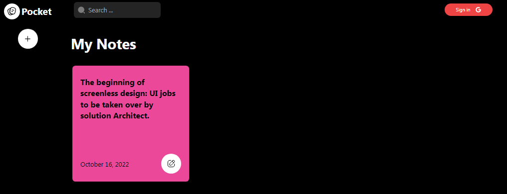

#  [Pocket-note](pocketnote.netlify.app)


> 🧑‍🚀 **Pocket note?** is a new app that allows you to take notes and store them in your pocket 😅(i mean your phone) . 
It's simple, convenient, and easy to use. 

> 🤯 One of the best features of Pocketnote is the ability to share your notes with others. 
Whether you're collaborating on a project or just want to share a funny note with a friend,
 Pocketnote makes it easy to do.




## 🚀 Project Structure

Inside of your the project, you'll see the following folders and files:

```
/
├── public/
│   └── favicon.svg
├── src/
│   ├── actions/
│   ├── assets/
│   ├── components/
│   ├── hooks/
│   ├── interface/
│   ├── styles/
│   ├── supabase/
│   ├── utils/
│   ├── layouts/
│   │   └── Header.tsx
│   └── pages/
│       └── Dashboard.tsx
└── .env
└── tsconfig.json
└── vite.config.js
└── package.json
```
## 🧑‍🚀 Roadmap
    - fix: new note [X]
    - feat: redirect to note edit url when user newly save a note [X]
    - fix: changing title name when in read-only [x]
    - feat: add loading indicator when deleting [x]
    - feat: shared notes [x]
    - feat: indicate readonly file [x]
    - feat: delete note [x]
    - style: progress loader [x]
    - fix: show loading indicator when loaading note [x ]
    - fix: Sanitize html inputs [x]
    - chore: add contribution guide [x]
    - chore: add .env.example [x]
    - chore: add MIT LICENSE []
    - feat: remove email from shared note [x]
    - feat: search [x]
    - fix: responsiveness [x]
    -feat: show indicator when save is needed []


## 🧞 Commands

All commands are run from the root of the project, from a terminal:

| Command                | Action                                             |
| :--------------------- | :------------------------------------------------- |
| `yarn install`          | Installs dependencies                              |
| `yarn dev`          | Starts local dev server at `localhost:5173`        |
| `yarn build`        | Build your production site to `./dist/`            |
| `yarn preview`      | Preview your build locally, before deploying       |
| `yarn vite ...`    | Run CLI commands like `vite optimize` |
| `yarn vite --help` | Get help using the vite CLI                       |

## 👀 Want to learn more?

Feel free to contribute [Contribution guide](/CONTRIBUTION.md) or view on [Openfork](https://openfork.dev/Timi-Leyin/pocket-note).
